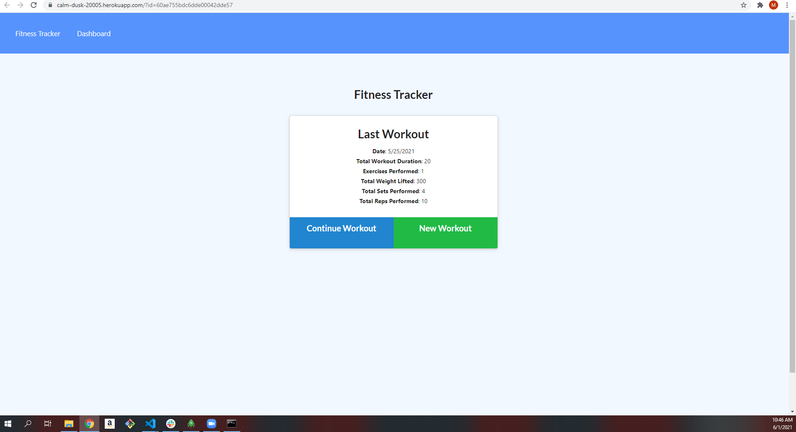
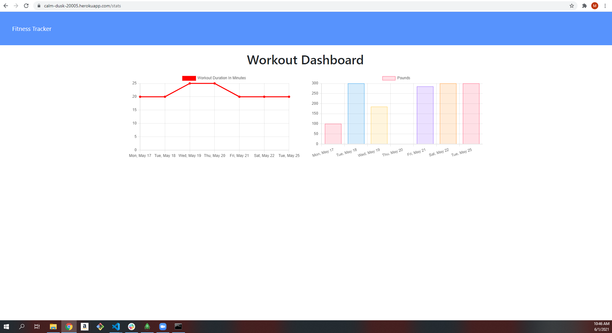

# workout-tracker

## Description

This is a workout tracker that allows the user to keep track of their cardio and resistance training exercises.
  
  
  ## License 
  * MIT, to view License information click the badge below!
  * 

  
  ## Technologies 
  
    * MongoDB
    * Mongoose
    * Express 
    * NodeJS
    * Markdown
  
 

  ## Installation 
  
    * To install the dependencies run npm i in the command line.
    * Run npm start in the terminal to start the app on the local host

  ## Deployment 
(https://calm-dusk-20005.herokuapp.com/?id=60ae755bdc6dde00042dde57)

  
  
  ## Contributions 
    Make pull requests to make changes.
  
  
  ## Support
  
  If you have any questions contact Michael, at moconnor0813@gmail.com or on github at https://github.com/oconnor97
  